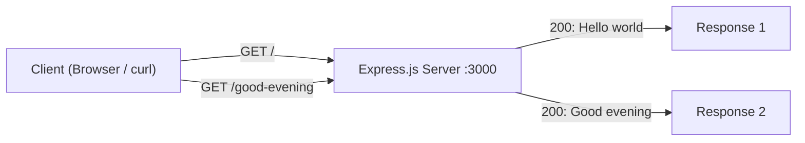

# Node.js Express Server Tutorial

This tutorial walks you through building a Node.js HTTP server using [Express.js](https://expressjs.com/). By the end, you will have a running Express.js server hosting two endpoints:

- **`GET /`** — returns the response `Hello world`
- **`GET /good-evening`** — returns the response `Good evening`

---

## Table of Contents

- [Prerequisites](#prerequisites)
- [Getting Started — Project Initialization](#getting-started--project-initialization)
- [Getting Started — Installing Express.js](#getting-started--installing-expressjs)
- [Building the Server — Creating server.js](#building-the-server--creating-serverjs)
- [Building the Server — Hello World Endpoint](#building-the-server--hello-world-endpoint)
- [Building the Server — Good Evening Endpoint](#building-the-server--good-evening-endpoint)
- [Running the Server](#running-the-server)
- [Testing the Endpoints](#testing-the-endpoints)
- [Request Flow Diagram](#request-flow-diagram)
- [Project Structure Summary](#project-structure-summary)
- [Further Reading](#further-reading)

---

## Prerequisites

Before starting this tutorial, make sure you have the following installed on your system:

- **Node.js** version **18 or higher** (Express.js 5.x requires Node.js 18+)
- **npm** version **9 or higher** (bundled with Node.js)

Verify your installed versions by running:

```bash
node --version
npm --version
```

If you see version numbers that meet the requirements above, you are ready to proceed. If Node.js is not installed or your version is below 18, download the latest LTS release from [https://nodejs.org/](https://nodejs.org/).

---

## Getting Started — Project Initialization

1. Create a new directory for your project and navigate into it:

```bash
mkdir my-express-server
cd my-express-server
```

2. Initialize a new Node.js project by running:

```bash
npm init -y
```

This command generates a `package.json` file with default settings. The output will look similar to this:

```json
{
  "name": "my-express-server",
  "version": "1.0.0",
  "description": "",
  "main": "index.js",
  "scripts": {
    "test": "echo \"Error: no test specified\" && exit 1"
  },
  "keywords": [],
  "author": "",
  "license": "ISC"
}
```

Here is a brief explanation of the key fields:

| Field | Description |
|---|---|
| `name` | The name of your project, derived from the directory name |
| `version` | The current version of your project, starting at `1.0.0` |
| `main` | The entry point file for your project (we will use `server.js` instead of the default `index.js`) |

---

## Getting Started — Installing Express.js

Install Express.js as a project dependency by running:

```bash
npm install express
```

This command downloads the Express.js package and its dependencies into the `node_modules/` directory. It also updates your `package.json` to include Express.js under the `dependencies` section:

```json
"dependencies": {
  "express": "^5.2.1"
}
```

This tutorial uses **Express.js v5.x**, the latest stable release. Express 5 includes improved routing, native promise support in middleware, and requires Node.js 18 or higher. For more details, visit the official Express.js documentation at [https://expressjs.com/](https://expressjs.com/).

---

## Building the Server — Creating server.js

Create a new file named `server.js` in your project root directory. This file will contain all of the server logic, including route definitions and the server startup command.

Add the following code to `server.js`:

```javascript
const express = require('express');
const app = express();
const PORT = 3000;

app.get('/', (req, res) => {
  res.send('Hello world');
});

app.get('/good-evening', (req, res) => {
  res.send('Good evening');
});

app.listen(PORT, () => {
  console.log(`Server is running on http://localhost:${PORT}`);
});
```

*Source: `server.js`*

### Line-by-Line Explanation

| Line | Code | Description |
|---|---|---|
| 1 | `const express = require('express');` | Imports the Express.js module using CommonJS `require` syntax |
| 2 | `const app = express();` | Creates an Express application instance that handles HTTP requests and routing |
| 3 | `const PORT = 3000;` | Defines the port number on which the server will listen for incoming connections |
| 5–7 | `app.get('/', (req, res) => { ... });` | Defines a GET route handler for the root path (`/`) that returns `Hello world` |
| 9–11 | `app.get('/good-evening', (req, res) => { ... });` | Defines a GET route handler for the `/good-evening` path that returns `Good evening` |
| 5, 9 | `res.send(...)` | Sends the specified string as the HTTP response body to the client |
| 13–15 | `app.listen(PORT, () => { ... });` | Starts the server and binds it to port 3000, executing the callback once the server is ready |

---

## Building the Server — Hello World Endpoint

The first endpoint is defined at the root path (`/`). When a client sends a `GET` request to `http://localhost:3000/`, the server responds with the exact string:

```
Hello world
```

The route handler uses `res.send('Hello world')` to write the response body and automatically sets the `Content-Type` header to `text/html; charset=utf-8`. Express.js also sets the appropriate `Content-Length` header and ends the response.

*Source: `server.js`*

---

## Building the Server — Good Evening Endpoint

The second endpoint is defined at the `/good-evening` path. When a client sends a `GET` request to `http://localhost:3000/good-evening`, the server responds with the exact string:

```
Good evening
```

This route handler follows the same pattern as the Hello World endpoint. The path `/good-evening` uses a hyphenated, lowercase URL convention that is clean and readable.

*Source: `server.js`*

---

## Running the Server

Start the server by running the following command from your project directory:

```bash
node server.js
```

You should see the following output in your terminal:

```
Server is running on http://localhost:3000
```

This confirms that the server is running and listening for requests on port **3000**.

### Using an npm Start Script (Optional)

You can also add a `start` script to your `package.json` for convenience:

```json
"scripts": {
  "start": "node server.js"
}
```

Then start the server using:

```bash
npm start
```

*Source: `package.json`*

---

## Testing the Endpoints

With the server running, you can test both endpoints using `curl` in a separate terminal window or by navigating to the URLs in your web browser.

### Testing the Hello World Endpoint

Using `curl`:

```bash
curl http://localhost:3000/
```

Expected output:

```
Hello world
```

Using a web browser, navigate to [http://localhost:3000/](http://localhost:3000/). You should see `Hello world` displayed on the page.

### Testing the Good Evening Endpoint

Using `curl`:

```bash
curl http://localhost:3000/good-evening
```

Expected output:

```
Good evening
```

Using a web browser, navigate to [http://localhost:3000/good-evening](http://localhost:3000/good-evening). You should see `Good evening` displayed on the page.

---

## Request Flow Diagram

The following diagram illustrates how HTTP requests flow through the Express.js server to each endpoint:



1. The client (a web browser or `curl`) sends an HTTP `GET` request to the server on port 3000.
2. The Express.js server matches the request path against the defined routes.
3. The matching route handler executes and sends the corresponding response string back to the client with an HTTP `200 OK` status code.

---

## Project Structure Summary

After completing this tutorial, your project directory should look like this:

```
project-root/
├── node_modules/
├── package.json
├── package-lock.json
└── server.js
```

| File/Directory | Description |
|---|---|
| `node_modules/` | Directory containing installed npm packages (Express.js and its dependencies) |
| `package.json` | Project manifest with metadata, scripts, and dependency declarations |
| `package-lock.json` | Auto-generated lock file that records the exact dependency tree installed |
| `server.js` | Main server file containing the Express.js application and route handlers |

---

## Further Reading

- [Express.js Official Site](https://expressjs.com/) — Comprehensive documentation, guides, and API reference for Express.js
- [Node.js Official Site](https://nodejs.org/) — Download Node.js, read documentation, and explore the Node.js ecosystem
- [Express.js on npm](https://www.npmjs.com/package/express) — Package details, version history, and installation instructions
