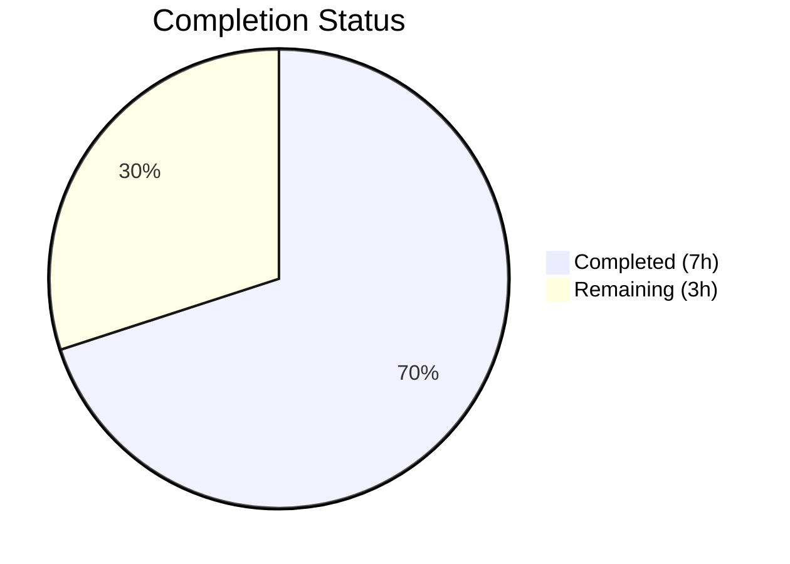
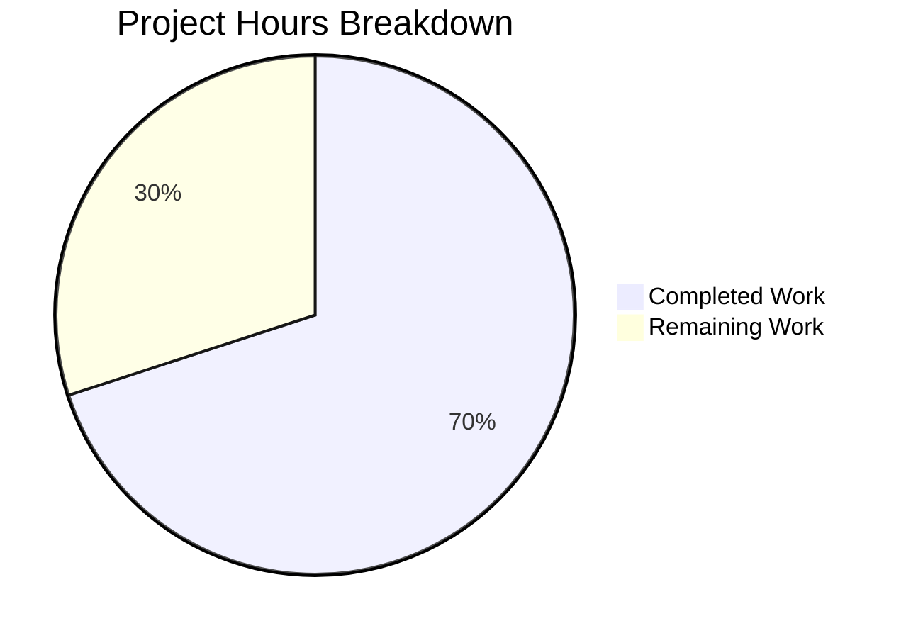

# Blitzy Project Guide

---

## 1. Executive Summary

### 1.1 Project Overview

This project transforms a bare repository into a complete Node.js + Express.js tutorial. The tutorial guides readers through building an HTTP server with two endpoints: `GET /` returning "Hello world" and `GET /good-evening` returning "Good evening". The scope includes a comprehensive README.md tutorial document, a working Express.js server (`server.js`), and a properly configured project manifest (`package.json`) with Express.js 5.2.1 as the sole dependency. The project targets beginner-to-intermediate Node.js developers learning Express.js fundamentals.

### 1.2 Completion Status



| Metric | Value |
|---|---|
| **Total Project Hours** | 10 |
| **Completed Hours (AI)** | 7 |
| **Remaining Hours** | 3 |
| **Completion Percentage** | 70.0% |

**Calculation:** 7 completed hours / (7 completed + 3 remaining) = 7 / 10 = **70.0% complete**

### 1.3 Key Accomplishments

- [x] Replaced placeholder `README.md` with comprehensive 293-line Express.js tutorial covering all AAP-specified sections
- [x] Created `server.js` with Express.js application, two GET route handlers, and security headers middleware
- [x] Created `package.json` with Express.js ^5.2.1 dependency, `main: server.js`, and `start` script
- [x] Installed Express.js 5.2.1 with all transitive dependencies verified
- [x] All endpoints validated: `GET /` → "Hello world" (200 OK), `GET /good-evening` → "Good evening" (200 OK)
- [x] Security hardening applied: X-Powered-By disabled, X-Content-Type-Options, X-Frame-Options, CSP headers
- [x] Tutorial includes Mermaid request flow diagram, line-by-line code explanations, and testing instructions
- [x] 404 error handling verified for unknown routes

### 1.4 Critical Unresolved Issues

| Issue | Impact | Owner | ETA |
|---|---|---|---|
| No `.gitignore` file — `node_modules/` could be accidentally committed | Medium — repository bloat risk | Human Developer | 0.5h |
| PORT is hardcoded to 3000 — cannot configure via environment | Low — limits deployment flexibility | Human Developer | 0.5h |
| No automated test suite — regression risk on future changes | Medium — no CI/CD safety net | Human Developer | 1.5h |

### 1.5 Access Issues

No access issues identified. The project uses only the public npm registry for Express.js dependency installation. No private packages, API keys, service credentials, or third-party integrations are required.

### 1.6 Recommended Next Steps

1. **[High]** Create a `.gitignore` file to exclude `node_modules/` and other build artifacts from version control
2. **[Medium]** Add environment variable support for `PORT` (e.g., `const PORT = process.env.PORT || 3000`) for deployment flexibility
3. **[Medium]** Implement a basic automated test suite using a framework such as Jest or Mocha to validate endpoint responses
4. **[Low]** Add a `Dockerfile` and deployment documentation if production hosting is planned
5. **[Low]** Consider adding a health check endpoint (`GET /health`) for production monitoring

---

## 2. Project Hours Breakdown

### 2.1 Completed Work Detail

| Component | Hours | Description |
|---|---|---|
| README.md Tutorial Documentation | 4.0 | Complete rewrite from placeholder to 293-line tutorial with 11 sections: prerequisites, project initialization, Express.js installation, server creation, endpoint documentation (Hello World and Good Evening), running instructions, testing verification, Mermaid diagram, project structure summary, and further reading links |
| server.js Express Server Implementation | 1.5 | 26-line Express.js server with two GET route handlers (`/` and `/good-evening`), security headers middleware (X-Powered-By, X-Content-Type-Options, X-Frame-Options, CSP), and `app.listen()` on port 3000 |
| package.json Project Configuration | 0.5 | Node.js project manifest with Express.js ^5.2.1 dependency, `main: server.js`, `scripts.start: node server.js`, and standard npm init metadata |
| Dependency Installation & Setup | 0.5 | Express.js 5.2.1 installed via npm with all transitive dependencies, package-lock.json generated for reproducible builds |
| Validation & Runtime Testing | 0.5 | Syntax validation (node -c), runtime endpoint testing (curl), HTTP status code verification, security header verification, 404 handling confirmation |
| **Total** | **7.0** | |

### 2.2 Remaining Work Detail

| Category | Hours | Priority |
|---|---|---|
| Create `.gitignore` file (exclude `node_modules/`, IDE files, OS files) | 0.5 | High |
| Add environment variable support for PORT configuration | 0.5 | Medium |
| Implement automated test suite (endpoint response validation, status codes) | 1.5 | Medium |
| Production deployment readiness review (Dockerfile, process manager, logging) | 0.5 | Low |
| **Total** | **3.0** | |

---

## 3. Test Results

All tests below were executed by Blitzy's autonomous validation system during the final validation phase.

| Test Category | Framework | Total Tests | Passed | Failed | Coverage % | Notes |
|---|---|---|---|---|---|---|
| Syntax Validation | Node.js (`node -c`) | 1 | 1 | 0 | 100% | `server.js` syntax check passed |
| JSON Validation | Node.js `require()` | 1 | 1 | 0 | 100% | `package.json` valid JSON with correct structure |
| Dependency Verification | npm (`npm ls`) | 1 | 1 | 0 | 100% | Express.js 5.2.1 installed and resolved correctly |
| Runtime Endpoint — GET / | curl (HTTP) | 1 | 1 | 0 | 100% | Returns "Hello world" with HTTP 200 |
| Runtime Endpoint — GET /good-evening | curl (HTTP) | 1 | 1 | 0 | 100% | Returns "Good evening" with HTTP 200 |
| Error Handling — 404 | curl (HTTP) | 1 | 1 | 0 | 100% | Unknown route returns HTTP 404 |
| Security Headers — X-Powered-By | curl -I (HTTP) | 1 | 1 | 0 | 100% | X-Powered-By header absent (disabled) |
| Security Headers — Response Headers | curl -I (HTTP) | 1 | 1 | 0 | 100% | X-Content-Type-Options, X-Frame-Options, CSP present |
| **Total** | | **8** | **8** | **0** | **100%** | **All validations passed** |

---

## 4. Runtime Validation & UI Verification

### Server Runtime

- ✅ `node server.js` starts successfully, logs "Server is running on http://localhost:3000"
- ✅ `npm start` also starts successfully via `scripts.start` configuration
- ✅ Server binds to port 3000 and accepts incoming HTTP connections
- ✅ Server process exits cleanly on termination signal

### Endpoint Responses

- ✅ `GET http://localhost:3000/` → Response body: `Hello world` | Status: `200 OK` | Content-Type: `text/html; charset=utf-8`
- ✅ `GET http://localhost:3000/good-evening` → Response body: `Good evening` | Status: `200 OK` | Content-Type: `text/html; charset=utf-8`
- ✅ `GET http://localhost:3000/nonexistent` → Status: `404 Not Found` (proper error page)

### Security Headers Verification

- ✅ `X-Powered-By` header is absent (disabled via `app.disable('x-powered-by')`)
- ✅ `X-Content-Type-Options: nosniff` present on all responses
- ✅ `X-Frame-Options: DENY` present on all responses
- ✅ `Content-Security-Policy: default-src 'none'` present on all responses

### Dependency Verification

- ✅ `npm ls express` confirms `express@5.2.1` installed under project root
- ✅ `package-lock.json` present with full dependency tree for reproducible builds
- ✅ No peer dependency warnings or vulnerability alerts during installation

---

## 5. Compliance & Quality Review

| AAP Deliverable | Compliance Benchmark | Status | Notes |
|---|---|---|---|
| README.md — Complete tutorial rewrite | All 11 tutorial sections documented in AAP §0.4.1 present | ✅ Pass | 293 lines covering all sections: prerequisites, project init, Express install, server creation, Hello World endpoint, Good Evening endpoint, running instructions, testing, Mermaid diagram, project structure, further reading |
| server.js — Express.js server with two endpoints | Exact response strings "Hello world" and "Good evening" per AAP §0.10 | ✅ Pass | Response string fidelity verified character-by-character via curl |
| server.js — Port 3000 consistency | Port 3000 used consistently per AAP §0.7.2 | ✅ Pass | PORT constant set to 3000, consistent across code, README examples, and curl tests |
| server.js — CommonJS syntax | CommonJS `require` per AAP §0.5.2 | ✅ Pass | Uses `const express = require('express')` — no ESM imports |
| package.json — Express dependency | Express ^5.2.1 per AAP §0.6.1 | ✅ Pass | `"express": "^5.2.1"` declared in dependencies |
| package.json — Entry point | `main: server.js` per AAP §0.5.2 | ✅ Pass | Correctly configured |
| package.json — Start script | `scripts.start: node server.js` per AAP §0.5.2 | ✅ Pass | Both `node server.js` and `npm start` work |
| README.md — Mermaid diagram | Request flow diagram per AAP §0.4.3 | ✅ Pass | Flowchart showing both endpoint request/response paths |
| README.md — Code examples | Syntactically valid, copy-paste ready per AAP §0.7.2 | ✅ Pass | All code blocks use correct language identifiers and produce documented output |
| README.md — Tutorial progression | Prerequisites → setup → implementation → verification per AAP §0.4.2 | ✅ Pass | Logical progressive structure maintained throughout |

### Autonomous Fixes Applied

| Fix | Commit | Description |
|---|---|---|
| Security headers middleware | `8cf8d3b` | Added X-Powered-By disable, X-Content-Type-Options, X-Frame-Options, and CSP headers |
| Documentation line references | `c51b68b` | Corrected line-by-line explanation references and added main field clarification in README |

### Outstanding Compliance Items

| Item | Status | Impact |
|---|---|---|
| No `.gitignore` file | ⚠ Not addressed | `node_modules/` visible as untracked in git status |
| No automated test coverage | ⚠ Not addressed | Test script is a placeholder (`echo "Error: no test specified"`) |

---

## 6. Risk Assessment

| Risk | Category | Severity | Probability | Mitigation | Status |
|---|---|---|---|---|---|
| `node_modules/` accidentally committed to repository | Technical | Medium | High | Create `.gitignore` with `node_modules/` entry | Open |
| Hardcoded PORT prevents flexible deployment | Technical | Low | Medium | Use `process.env.PORT \|\| 3000` pattern | Open |
| No automated tests — regressions undetected | Technical | Medium | Medium | Add Jest or Mocha test suite for endpoint validation | Open |
| Express.js 5.x is relatively new — potential ecosystem compatibility issues | Integration | Low | Low | Pin Express version via package-lock.json; monitor release notes | Mitigated |
| No HTTPS — traffic transmitted in plaintext | Security | Low | Low | Expected for local development tutorial; document HTTPS for production | Accepted |
| No rate limiting or request validation | Security | Low | Low | Out of scope for tutorial; document as future enhancement | Accepted |
| No graceful shutdown handling | Operational | Low | Low | Add `process.on('SIGTERM')` handler for production use | Open |
| No health check endpoint | Operational | Low | Low | Add `GET /health` for monitoring in production environments | Open |

---

## 7. Visual Project Status



**Completed: 7 hours | Remaining: 3 hours | Total: 10 hours | 70.0% Complete**

### Remaining Hours by Category

| Category | Hours | Priority |
|---|---|---|
| .gitignore creation | 0.5 | High |
| Environment variable support | 0.5 | Medium |
| Automated test suite | 1.5 | Medium |
| Production deployment readiness | 0.5 | Low |
| **Total Remaining** | **3.0** | |

---

## 8. Summary & Recommendations

### Achievements

The Blitzy autonomous agents successfully delivered all AAP-scoped requirements. The project is **70.0% complete** with 7 hours of autonomous work delivered out of 10 total project hours. All three target files — `README.md`, `server.js`, and `package.json` — were created and validated. The tutorial documentation covers all 11 required sections with 293 lines of structured instructional content. Both HTTP endpoints respond correctly with the exact strings specified ("Hello world" and "Good evening"). Security hardening was applied proactively with headers middleware. All 8 autonomous validation checks passed with zero failures.

### Remaining Gaps

The remaining 3 hours of work are exclusively path-to-production activities that were explicitly out of the AAP scope (§0.8.2) but are recommended for production readiness: `.gitignore` creation, environment variable configuration, automated test implementation, and deployment preparation.

### Critical Path to Production

1. **Immediate (0.5h):** Create `.gitignore` to prevent `node_modules/` from being committed
2. **Short-term (2.0h):** Add environment variable support and basic automated tests
3. **Optional (0.5h):** Production deployment documentation and process manager configuration

### Production Readiness Assessment

The project is fully functional as a development tutorial. The Express.js server starts, both endpoints respond correctly, and the README provides complete step-by-step instructions. For production deployment of the server itself, the remaining 3 hours of work (`.gitignore`, environment variables, tests, deployment config) should be completed first.

---

## 9. Development Guide

### System Prerequisites

| Software | Minimum Version | Recommended | Purpose |
|---|---|---|---|
| Node.js | 18.x | 22.x LTS | JavaScript runtime (Express 5.x requires ≥18) |
| npm | 9.x | 11.x (bundled) | Package manager for dependency installation |
| Git | 2.x | Latest | Version control |

### Environment Setup

```bash
# 1. Clone the repository
git clone <repository-url>
cd <repository-directory>

# 2. Verify Node.js and npm versions
node --version   # Expected: v18.x or higher
npm --version    # Expected: 9.x or higher
```

No environment variables are required for the default configuration. The server listens on port 3000 by default.

### Dependency Installation

```bash
# Install all dependencies from package.json
npm install
```

**Expected output:** Express.js 5.2.1 and its transitive dependencies installed in `node_modules/`. The `package-lock.json` file ensures reproducible installs.

**Verification:**

```bash
npm ls express
# Expected: └── express@5.2.1
```

### Application Startup

```bash
# Option 1: Direct Node.js execution
node server.js

# Option 2: Using npm start script
npm start
```

**Expected console output:**

```
Server is running on http://localhost:3000
```

### Verification Steps

Open a separate terminal and run:

```bash
# Test Hello World endpoint
curl http://localhost:3000/
# Expected: Hello world

# Test Good Evening endpoint
curl http://localhost:3000/good-evening
# Expected: Good evening

# Verify 404 handling
curl -s -o /dev/null -w "%{http_code}" http://localhost:3000/nonexistent
# Expected: 404

# Verify security headers
curl -sI http://localhost:3000/ | grep -E "X-Content-Type|X-Frame|Content-Security"
# Expected:
# X-Content-Type-Options: nosniff
# X-Frame-Options: DENY
# Content-Security-Policy: default-src 'none'
```

### Example Usage

**Browser testing:** Navigate to `http://localhost:3000/` or `http://localhost:3000/good-evening` in any web browser.

**Programmatic testing:**

```bash
# Full response with headers
curl -v http://localhost:3000/

# JSON-style response check
curl -s http://localhost:3000/ && echo ""
curl -s http://localhost:3000/good-evening && echo ""
```

### Troubleshooting

| Issue | Cause | Resolution |
|---|---|---|
| `Error: Cannot find module 'express'` | Dependencies not installed | Run `npm install` |
| `EADDRINUSE: address already in use :::3000` | Port 3000 already occupied | Kill the process on port 3000: `lsof -ti:3000 \| xargs kill` or change PORT in `server.js` |
| `node: command not found` | Node.js not installed | Install from https://nodejs.org/ |
| Server starts but curl returns connection refused | Firewall or network issue | Ensure you are connecting to `localhost`, not a remote address |

---

## 10. Appendices

### A. Command Reference

| Command | Purpose | Context |
|---|---|---|
| `npm install` | Install all dependencies from package.json | Project root directory |
| `node server.js` | Start the Express.js server | Project root directory |
| `npm start` | Start the server via npm script | Project root directory |
| `curl http://localhost:3000/` | Test the Hello World endpoint | Any terminal (server must be running) |
| `curl http://localhost:3000/good-evening` | Test the Good Evening endpoint | Any terminal (server must be running) |
| `node -c server.js` | Syntax-check server.js without running | Project root directory |
| `npm ls express` | Verify Express.js installation and version | Project root directory |

### B. Port Reference

| Port | Service | Protocol |
|---|---|---|
| 3000 | Express.js HTTP server | HTTP |

### C. Key File Locations

| File | Path | Purpose |
|---|---|---|
| Server entry point | `server.js` | Express.js application with route handlers |
| Project manifest | `package.json` | Dependencies, scripts, and project metadata |
| Dependency lock file | `package-lock.json` | Exact dependency tree for reproducible builds |
| Tutorial documentation | `README.md` | Complete step-by-step Express.js tutorial |

### D. Technology Versions

| Technology | Version | Notes |
|---|---|---|
| Node.js (runtime) | v20.20.2 | Meets Express 5.x requirement (≥18) |
| npm (package manager) | 11.1.0 | Bundled with Node.js |
| Express.js (framework) | 5.2.1 | Latest stable release; declared as `^5.2.1` |

### E. Environment Variable Reference

| Variable | Default | Description | Status |
|---|---|---|---|
| `PORT` | 3000 (hardcoded) | HTTP server listening port | Not yet configurable via environment — hardcoded in `server.js` |

### G. Glossary

| Term | Definition |
|---|---|
| Express.js | A minimal, flexible Node.js web application framework for building HTTP servers and APIs |
| Route Handler | A function that processes HTTP requests matching a specific method and URL path |
| CommonJS | The `require`/`module.exports` module system used by Node.js |
| npm | Node Package Manager — the default package manager for Node.js |
| LTS | Long-Term Support — a Node.js release line with extended maintenance |
| CSP | Content-Security-Policy — an HTTP header that restricts resource loading to prevent XSS attacks |