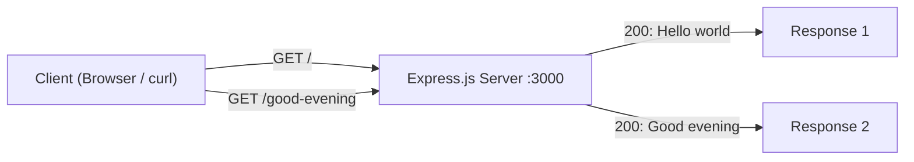

# Technical Specification

# 0. Agent Action Plan

## 0.1 Intent Clarification

### 0.1.1 Core Documentation Objective

Based on the provided requirements, the Blitzy platform understands that the documentation objective is to **update and extend an existing tutorial document** for a Node.js server project. The user describes a tutorial that currently documents a Node.js server hosting a single HTTP endpoint returning the response "Hello world." The user requests two modifications to this tutorial:

- **Integrate Express.js** into the project as the HTTP framework, replacing or augmenting the existing native Node.js `http` module approach
- **Document a new endpoint** that returns the response "Good evening"

**Documentation Request Category:** Update existing documentation

**Documentation Type:** Tutorial (step-by-step development guide)

**Requirements Restated with Technical Precision:**

| # | User Requirement | Technical Interpretation |
|---|---|---|
| 1 | "this is a tutorial of node js server hosting one endpoint that returns the response 'Hello world'" | The existing `README.md` serves as a tutorial document describing a basic Node.js HTTP server using the built-in `http` module with a single endpoint that responds with the plain-text string "Hello world" |
| 2 | "Could you add expressjs into the project" | Document the installation of the Express.js npm package as a project dependency and refactor the server tutorial code from the native `http` module to the Express.js framework |
| 3 | "add another endpoint that return the reponse of 'Good evening'" | Document a second HTTP GET endpoint (e.g., `/good-evening`) that returns the plain-text string "Good evening" using the Express.js routing API |

**Inferred Documentation Needs:**

- The repository currently contains only a minimal `README.md` with the heading `# 10feb_66` and no source code, meaning the tutorial content must be created from scratch within the documentation
- Since Express.js is being introduced, the tutorial must include: project initialization (`npm init`), dependency installation (`npm install express`), basic Express.js server setup, route definitions, and instructions for running the server
- The tutorial should cover both endpoints: the original "Hello world" endpoint and the new "Good evening" endpoint, both implemented using Express.js
- A `package.json` manifest must be documented as part of the tutorial's project setup steps

### 0.1.2 Special Instructions and Constraints

- **No explicit style or template directives** were provided by the user
- **No design system** is specified or relevant to this documentation task
- **No Figma attachments** were provided
- **No environment variables or secrets** are required for this tutorial
- The user's request was repeated four times identically, indicating emphasis on the same core requirement rather than additional instructions
- The documentation should follow a tutorial progression: setup → existing functionality → new dependency → new feature

### 0.1.3 Technical Interpretation

These documentation requirements translate to the following technical documentation strategy:

- To document the project setup, we will **update** `README.md` with a complete tutorial covering Node.js project initialization and Express.js installation
- To document the "Hello world" endpoint, we will **create** tutorial content showing an Express.js route handler at the root path (`/`) returning "Hello world"
- To document the "Good evening" endpoint, we will **create** tutorial content showing an Express.js route handler at a dedicated path (e.g., `/good-evening`) returning "Good evening"
- To provide a complete learning experience, we will **structure** the tutorial with prerequisites, step-by-step instructions, code examples, and verification steps

### 0.1.4 Inferred Documentation Needs

Based on repository analysis, the following implicit documentation needs have been identified:

- **Project initialization guide:** The repository lacks a `package.json` — the tutorial must document `npm init` and project scaffolding
- **Dependency management:** Express.js is not present in the repository — the tutorial must document `npm install express` and explain the resulting `package.json` entry
- **Server entry point:** No source files exist — the tutorial must document the creation of the main server file (e.g., `server.js` or `index.js`)
- **Running and testing instructions:** The tutorial must include commands to start the server and verify both endpoints respond correctly
- **Express.js fundamentals:** Since this is a tutorial introducing Express.js, basic concepts like routing, request/response handling, and middleware context should be explained

## 0.2 Documentation Discovery and Analysis

### 0.2.1 Existing Documentation Infrastructure Assessment

A comprehensive repository search was conducted to identify all existing documentation assets, infrastructure, and tooling. The repository is in a pre-development state with minimal content.

**Repository Search Results:**

| Search Target | Pattern | Result |
|---|---|---|
| README files | `README*` | `README.md` found — contains only `# 10feb_66` (single heading, no tutorial content) |
| Documentation directories | `docs/**` | Not found — no `docs/` directory exists |
| Markdown files | `*.md`, `*.mdx` | Only `README.md` at root |
| reStructuredText files | `*.rst` | Not found |
| Documentation generators | `mkdocs.yml`, `docusaurus.config.js`, `sphinx.conf.py` | Not found |
| API documentation tools | JSDoc config, TypeDoc config | Not found |
| Dependency manifests | `package.json`, `package-lock.json` | Not found |
| Source code files | `*.js`, `*.ts`, `*.mjs` | Not found |
| Configuration files | `.nvmrc`, `.node-version`, `.editorconfig` | Not found |
| CI/CD configuration | `.github/`, `.gitlab-ci.yml` | Not found |
| Git ignore | `.gitignore` | Not found |
| Blitzy ignore | `.blitzyignore` | Not found |

**Repository Analysis Summary:** The repository analysis reveals a scaffold-stage project with a single placeholder `README.md` containing only the project identifier heading. No documentation framework, no source code, no dependency manifests, and no configuration files exist. The entire tutorial content — including project structure, code examples, and instructional narrative — must be authored from scratch.

- **Current documentation framework:** None detected
- **Documentation generator configuration:** None present
- **API documentation tools in use:** None
- **Diagram tools detected:** None
- **Documentation hosting/deployment setup:** None

### 0.2.2 Repository Code Analysis for Documentation

Since the repository contains no source code, the code analysis focuses on what must be documented as part of the tutorial:

**Search patterns applied:**

| Target | Pattern | Finding |
|---|---|---|
| Server entry points | `server.js`, `index.js`, `app.js` | Not found — must be documented as new file creation |
| Package configuration | `package.json` | Not found — must be documented as new file creation |
| Route definitions | `routes/**`, `*.routes.js` | Not found — routes will be defined inline in the tutorial server file |
| Test files | `test/**`, `*.test.js`, `*.spec.js` | Not found |
| Example files | `examples/**` | Not found |

**Key directories examined:** Root directory (`/`) — the only directory level present. No subdirectories exist.

**Related documentation found:** None — the `README.md` at `README.md` contains only the heading `# 10feb_66` and provides no tutorial content, code examples, or instructional material.

### 0.2.3 Web Search Research Conducted

The following web research was performed to inform documentation best practices and validate technical details:

| Research Topic | Key Findings |
|---|---|
| Express.js latest stable version | Express.js **5.2.1** is the latest version on npm; Express v5 was officially released as stable with Node.js 18+ requirement |
| Express.js v5 changes | Dropped support for Node.js before v18; updated routing with `path-to-regexp@8.x`; promise support in middleware; removed deprecated v3/v4 API methods |
| Node.js LTS versions | Node.js 22 is Active LTS; Node.js 24.14.1 is the latest LTS release; Node.js 20 support ending April 2026 |
| Express.js tutorial best practices | Official npm example uses `app.get('/', ...)` pattern with `app.listen()` — consistent with the documented approach for this tutorial |

## 0.3 Documentation Scope Analysis

### 0.3.1 Code-to-Documentation Mapping

Since the repository contains no existing source code, the documentation mapping is based on the files and modules that the tutorial will instruct the reader to create. Each documented artifact maps directly to tutorial content.

**Modules Requiring Documentation:**

- **Module: `server.js` (to be created by tutorial reader)**
  - Public APIs: Express application instance, `GET /` route handler (returns "Hello world"), `GET /good-evening` route handler (returns "Good evening"), `app.listen()` server startup
  - Current documentation: Missing — no file exists
  - Documentation needed: Complete step-by-step creation guide with full code listing, line-by-line explanation, and running instructions

- **Module: `package.json` (to be created by tutorial reader)**
  - Configuration options: `name`, `version`, `description`, `main`, `scripts.start`, `dependencies.express`
  - Current documentation: Missing — no file exists
  - Documentation needed: Project initialization walkthrough (`npm init`) and dependency installation (`npm install express`)

**Configuration Options Requiring Documentation:**

| Config Element | File | Documentation Status | Tutorial Coverage Needed |
|---|---|---|---|
| `name` | `package.json` | Missing | Document via `npm init` step |
| `main` | `package.json` | Missing | Document as `server.js` entry point |
| `scripts.start` | `package.json` | Missing | Document as `node server.js` |
| `dependencies.express` | `package.json` | Missing | Document via `npm install express` |
| Express port | `server.js` | Missing | Document as `const PORT = 3000` |

**Features Requiring User Guides:**

| Feature | Current Coverage | Documentation Gaps |
|---|---|---|
| Node.js HTTP server (native) | None | Introductory context explaining the starting point before Express.js migration |
| Express.js integration | None | Installation, import, app creation, route definition |
| "Hello world" endpoint | None | Route handler, response method, testing with browser/curl |
| "Good evening" endpoint | None | Additional route handler, unique path, testing |
| Server startup and verification | None | `app.listen()`, port configuration, verification commands |

### 0.3.2 Documentation Gap Analysis

Given the requirements and repository analysis, documentation gaps include the following:

**Undocumented Project Structure:**
- No `package.json` exists — the entire project initialization process is undocumented
- No `.gitignore` — node_modules exclusion pattern is not documented
- No source files — the complete server implementation is undocumented

**Missing Tutorial Sections:**
- Prerequisites (Node.js and npm installation verification)
- Project initialization and scaffolding
- Express.js dependency installation
- Server file creation with Express.js
- Route definition for "Hello world" (`GET /`)
- Route definition for "Good evening" (`GET /good-evening`)
- Server startup and testing instructions
- Expected output and verification steps

**Undocumented Concepts:**
- Express.js application creation pattern (`express()`)
- Express.js routing (`app.get()`)
- Express.js response methods (`res.send()`)
- Server listening and port binding (`app.listen()`)

## 0.4 Documentation Implementation Design

### 0.4.1 Documentation Structure Planning

The tutorial documentation will be consolidated into the existing `README.md` file, which is the natural home for a single-file tutorial project. The structure follows a progressive tutorial pattern moving from setup through implementation to verification.

**Planned Documentation Hierarchy:**

```
README.md
├── Project Title and Overview
├── Prerequisites
├── Getting Started
│   ├── Project Initialization
│   └── Installing Express.js
├── Building the Server
│   ├── Creating the Server File
│   ├── Hello World Endpoint
│   └── Good Evening Endpoint
├── Running the Server
├── Testing the Endpoints
│   ├── Testing Hello World
│   └── Testing Good Evening
└── Project Structure Summary
```

### 0.4.2 Content Generation Strategy

**Information Extraction Approach:**

- "Generate project initialization content by documenting standard `npm init -y` output and `npm install express` commands"
- "Create Express.js server code examples based on the official Express.js v5 API patterns documented at npmjs.com/package/express"
- "Produce verification steps by documenting expected HTTP responses for each endpoint"

**Documentation Standards:**

- Markdown formatting with proper headers (`#`, `##`, `###`)
- Code examples using fenced code blocks with `javascript` and `bash` language identifiers for syntax highlighting
- Inline code for file names, commands, and code references (e.g., `server.js`, `npm install`)
- Step-by-step numbered instructions within each section for clear tutorial progression
- Source citations referencing the tutorial's own files: `Source: server.js`, `Source: package.json`
- Terminal output examples in plain code blocks to show expected results

### 0.4.3 Diagram and Visual Strategy

**Mermaid diagrams to include in the tutorial documentation:**

- **Request flow diagram:** A flowchart showing how HTTP requests reach each Express.js endpoint and return responses — illustrating the `GET /` → "Hello world" and `GET /good-evening` → "Good evening" routing paths



- **Project structure diagram:** A simple tree showing the final file layout after completing the tutorial (`package.json`, `node_modules/`, `server.js`)

No screenshot or image requirements apply — this is a code-focused tutorial that uses text-based diagrams and terminal output examples exclusively.

## 0.5 Documentation File Transformation Mapping

### 0.5.1 File-by-File Documentation Plan

The following table maps every documentation file to be created or updated, with the target documentation file listed first. This is the exhaustive list — no documentation files remain pending or to be discovered.

| Target Documentation File | Transformation | Source Code/Docs | Content/Changes |
|---|---|---|---|
| `README.md` | UPDATE | `README.md` | Replace the placeholder heading `# 10feb_66` with a complete Node.js + Express.js tutorial covering project setup, Express.js installation, two endpoint implementations ("Hello world" at `GET /` and "Good evening" at `GET /good-evening`), server startup instructions, and endpoint testing verification |
| `server.js` | CREATE | N/A (new tutorial code) | Main Express.js server file documented in the tutorial — contains Express import, app initialization, two GET route handlers, and `app.listen()` call on port 3000 |
| `package.json` | CREATE | N/A (generated by `npm init`) | Node.js project manifest documented in the tutorial — generated via `npm init -y` and updated via `npm install express` to include Express.js 5.x as a dependency |

### 0.5.2 New Documentation Files Detail

**File: `README.md` (UPDATE — from placeholder to complete tutorial)**

```
File: README.md
Type: Tutorial (step-by-step development guide)
Source Code: server.js (documented inline), package.json (documented inline)
Sections:
    - Project Title and Description (purpose of the tutorial)
    - Prerequisites (Node.js >= 18, npm)
    - Getting Started — Project Initialization (npm init -y)
    - Getting Started — Installing Express.js (npm install express)
    - Building the Server — Creating server.js
    - Building the Server — Hello World Endpoint (GET /)
    - Building the Server — Good Evening Endpoint (GET /good-evening)
    - Running the Server (node server.js)
    - Testing the Endpoints (browser and curl verification)
    - Project Structure Summary (final file tree)
Diagrams:
    - Request flow diagram (Mermaid flowchart showing both endpoints)
Key Citations: server.js, package.json
```

**File: `server.js` (CREATE — tutorial instructs reader to create)**

```
File: server.js
Type: Source code file (created by tutorial reader)
Purpose: Express.js HTTP server with two endpoints
Contents documented in tutorial:
    - Import Express.js module
    - Create Express application instance
    - Define GET / route returning "Hello world"
    - Define GET /good-evening route returning "Good evening"
    - Start server listening on port 3000
```

**File: `package.json` (CREATE — tutorial instructs reader to generate)**

```
File: package.json
Type: Project manifest (generated by npm init)
Purpose: Node.js project configuration and dependency declaration
Contents documented in tutorial:
    - Standard npm init fields (name, version, main)
    - start script (node server.js)
    - Express.js dependency entry
```

### 0.5.3 Documentation Files to Update Detail

- **`README.md`** — Transform from placeholder to complete tutorial
  - Remove: Single placeholder heading `# 10feb_66`
  - Add: Full tutorial title with descriptive project heading
  - Add: Prerequisites section listing Node.js and npm requirements
  - Add: Step-by-step project initialization guide
  - Add: Express.js installation instructions with expected output
  - Add: Complete `server.js` code listing with line-by-line annotations
  - Add: Endpoint testing section with curl commands and expected responses
  - Add: Mermaid request flow diagram
  - Add: Final project structure tree
  - Source citations: `server.js`, `package.json`

### 0.5.4 Documentation Configuration Updates

No documentation generator configuration files require updates because:
- No `mkdocs.yml`, `docusaurus.config.js`, `.readthedocs.yml`, or `sphinx/conf.py` exists in the repository
- The documentation is self-contained in `README.md` and requires no build pipeline
- No `package.json` documentation scripts need updating (the `package.json` itself is part of the tutorial content, not a documentation build tool)

### 0.5.5 Cross-Documentation Dependencies

- **Shared content/includes:** None — all tutorial content is self-contained within `README.md`
- **Navigation links between documents:** Not applicable — single-file documentation
- **Table of contents updates:** An inline table of contents within `README.md` should be included to aid navigation of tutorial sections
- **Index/glossary updates:** Not applicable for a single tutorial document

## 0.6 Dependency Inventory

### 0.6.1 Documentation Dependencies

The following table lists all key packages and tools relevant to this documentation exercise. Versions have been verified against the npm registry and Node.js release data.

| Registry | Package Name | Version | Purpose |
|---|---|---|---|
| npm | `express` | 5.2.1 | Express.js web framework — the primary dependency documented in the tutorial for creating HTTP endpoints |
| Runtime | `node` | >= 18.x (LTS recommended: 22.x) | Node.js JavaScript runtime — required to execute the tutorial server; Express 5.x mandates Node.js 18 or higher |
| Runtime | `npm` | >= 9.x (bundled with Node.js) | Node.js package manager — used in the tutorial for project initialization and dependency installation |

**Version Verification Notes:**

- Express.js **5.2.1** is confirmed as the latest stable release on the npm registry as of April 2026. The `engines` field in the Express package specifies `{ node: '>= 18' }`, confirming compatibility with Node.js 18, 20, 22, and 24 LTS lines.
- No additional documentation-generation tools (such as MkDocs, Docusaurus, Sphinx, or TypeDoc) are required because the documentation is authored directly as a Markdown tutorial in `README.md`.
- No development dependencies (linters, formatters, test frameworks) are in scope for this documentation task, though they may be recommended in future tutorial extensions.

### 0.6.2 Documentation Reference Updates

**Documentation files requiring link updates:** Not applicable — no existing internal or external links exist in the current `README.md` placeholder.

**Link additions for the updated `README.md`:**

| Link Target | URL | Context |
|---|---|---|
| Express.js official site | `https://expressjs.com/` | Referenced in the prerequisites or further reading section |
| Node.js official site | `https://nodejs.org/` | Referenced in the prerequisites section for Node.js installation |
| Express.js npm page | `https://www.npmjs.com/package/express` | Optional reference for readers wanting to explore the package |

## 0.7 Coverage and Quality Targets

### 0.7.1 Documentation Coverage Metrics

**Current coverage analysis:**

| Coverage Dimension | Current State | Target State |
|---|---|---|
| Project setup documented | 0% (no setup instructions) | 100% — complete `npm init` and `npm install` walkthrough |
| Express.js integration documented | 0% (Express.js not mentioned) | 100% — full import, configuration, and usage documentation |
| Endpoint documentation (GET /) | 0% (no endpoint docs) | 100% — route handler code, explanation, and test command |
| Endpoint documentation (GET /good-evening) | 0% (no endpoint docs) | 100% — route handler code, explanation, and test command |
| Server startup instructions | 0% (no run instructions) | 100% — `node server.js` command with expected console output |
| Prerequisites documented | 0% (no prerequisites listed) | 100% — Node.js and npm version requirements |
| Verification/testing steps | 0% (no testing guidance) | 100% — curl commands and expected HTTP responses for both endpoints |

**Target coverage:** 100% of all user-requested functionality documented — every element of the tutorial must be complete and actionable.

**Coverage gaps to address:**

| Gap | Current % | Target % | Focus Areas |
|---|---|---|---|
| `README.md` tutorial content | 0% | 100% | All tutorial sections from setup through verification |
| Code examples | 0% | 100% | Complete `server.js` listing, `package.json` contents, terminal commands |
| Diagram coverage | 0% | 100% | Request flow Mermaid diagram |

### 0.7.2 Documentation Quality Criteria

**Completeness requirements:**
- The tutorial `README.md` must contain every step needed for a reader to go from an empty project to a running Express.js server with two endpoints
- All code examples must be syntactically correct and copy-paste ready
- All terminal commands must include expected output where applicable
- The "Hello world" and "Good evening" response strings must match the user's exact specification

**Accuracy validation:**
- Code examples must use Express.js v5.x API syntax (e.g., ESM-compatible imports or CommonJS `require`)
- The `package.json` dependency entry must reflect `express` version `^5.2.1` or equivalent semver range
- Port number (3000) and endpoint paths (`/`, `/good-evening`) must be consistent across all code examples, instructions, and test commands

**Clarity standards:**
- Technical accuracy with accessible language appropriate for a tutorial audience
- Progressive disclosure: start with prerequisites, advance through setup, build to implementation, conclude with verification
- Each tutorial step should be self-contained and verifiable before proceeding to the next

**Maintainability:**
- Source citations reference the tutorial's own documented files (`server.js`, `package.json`)
- Express.js version pinned in documentation to avoid ambiguity for future readers

### 0.7.3 Example and Diagram Requirements

| Requirement | Target | Details |
|---|---|---|
| Code examples per endpoint | 1 complete listing each | Full route handler code for `GET /` and `GET /good-evening` |
| Complete server code listing | 1 | Full `server.js` contents shown as a single cohesive block |
| Terminal command examples | 4+ | `npm init -y`, `npm install express`, `node server.js`, `curl` test commands |
| Mermaid diagrams | 1 | Request flow diagram showing both endpoints |
| Expected output examples | 3+ | `npm init` output, server startup console log, curl response output |

## 0.8 Scope Boundaries

### 0.8.1 Exhaustively In Scope

**Documentation files to update:**
- `README.md` — Complete rewrite from placeholder heading to full Node.js + Express.js tutorial

**Source code files documented in the tutorial (created by reader):**
- `server.js` — Express.js server with two GET route handlers
- `package.json` — Project manifest generated via `npm init` with Express.js dependency

**Tutorial content areas:**
- Prerequisites section (Node.js >= 18, npm)
- Project initialization (`npm init -y`)
- Express.js dependency installation (`npm install express`)
- Server file creation (`server.js`) with Express.js application setup
- `GET /` endpoint returning "Hello world"
- `GET /good-evening` endpoint returning "Good evening"
- Server startup instructions (`node server.js`)
- Endpoint testing and verification (curl commands, browser testing)
- Mermaid request flow diagram
- Final project structure summary

**Documentation assets:**
- Inline Mermaid diagrams within `README.md`
- Inline code blocks within `README.md`

### 0.8.2 Explicitly Out of Scope

- **Source code modifications:** No actual source code files will be committed to the repository as part of this documentation task — the tutorial documents the creation of `server.js` and `package.json` but does not create them
- **Test file creation:** No test files (`*.test.js`, `*.spec.js`) are in scope — testing is documented only as manual verification steps (curl/browser)
- **Additional Express.js features:** Middleware configuration, error handling middleware, template engines, static file serving, and other advanced Express.js features are not requested and are excluded
- **Deployment documentation:** No deployment, hosting, containerization, or CI/CD documentation is in scope
- **Database integration:** No database setup, ORM configuration, or data persistence documentation is in scope
- **Authentication/authorization:** No security middleware, JWT, or session documentation is in scope
- **Documentation build tooling:** No MkDocs, Docusaurus, Sphinx, or other documentation generators will be configured
- **API specification formats:** No OpenAPI/Swagger, AsyncAPI, or formal API specification documents will be created
- **TypeScript migration:** The tutorial uses plain JavaScript; TypeScript conversion is not in scope
- **Frontend/UI documentation:** No HTML templates, CSS, or frontend assets are documented
- **Other frameworks or libraries:** Flask, React, LangChain, and other frameworks mentioned in the broader tech spec are not relevant to this documentation task

## 0.9 Execution Parameters

### 0.9.1 Documentation-Specific Instructions

| Parameter | Value |
|---|---|
| **Documentation build command** | Not applicable — documentation is authored directly in Markdown (`README.md`) with no build step required |
| **Documentation preview command** | Any Markdown viewer or `npx marked README.md` for HTML preview; GitHub/GitLab renders `README.md` natively |
| **Diagram generation command** | Mermaid diagrams are embedded inline in Markdown and rendered by GitHub, GitLab, and most Markdown viewers natively |
| **Documentation deployment command** | Not applicable — no documentation hosting pipeline exists; `README.md` is served directly by the repository hosting platform |
| **Default format** | Markdown with Mermaid diagrams |
| **Citation requirement** | Each code example section references its source file (`server.js` or `package.json`) |
| **Style guide** | Standard tutorial progression: prerequisites → setup → implementation → verification; code-first approach with explanatory prose |
| **Documentation validation** | Manual review for Markdown syntax correctness; no automated linting or link-checking tools are configured |

### 0.9.2 Tutorial Execution Sequence

The following commands represent the documented tutorial flow that readers will execute. These commands also serve as the validation sequence for documentation accuracy:

```bash
# Step 1: Initialize Node.js project

npm init -y

#### Step 2: Install Express.js

npm install express

#### Step 3: Run the server (after creating server.js)

node server.js

#### Step 4: Test endpoints

curl http://localhost:3000/
curl http://localhost:3000/good-evening
```

**Expected verification outputs:**

- `curl http://localhost:3000/` → `Hello world`
- `curl http://localhost:3000/good-evening` → `Good evening`
- Server console → `Server is running on http://localhost:3000`

## 0.10 Rules for Documentation

No explicit documentation-specific rules or constraints were provided by the user. The following default documentation rules apply based on best practices for tutorial documentation:

- **Response string fidelity:** The endpoint responses must use the exact strings specified by the user — "Hello world" for the first endpoint and "Good evening" for the second endpoint — with no alterations to casing, punctuation, or wording
- **Tutorial completeness:** Every step in the tutorial must be self-contained and actionable; a reader should be able to follow the tutorial from start to finish without external references
- **Code example correctness:** All code examples must be syntactically valid JavaScript compatible with Express.js 5.x and Node.js 18+
- **Command reproducibility:** All terminal commands documented in the tutorial must produce the documented output when executed in the specified order on a system meeting the stated prerequisites

## 0.11 References

### 0.11.1 Repository Files and Folders Searched

The following files and folders were inspected during the documentation discovery and analysis phase:

| Path | Type | Finding |
|---|---|---|
| `/` (root) | Folder | Contains only `README.md`; no subdirectories, no source code, no configuration files |
| `README.md` | File | Single-line content: `# 10feb_66` — placeholder heading with no tutorial content |

**Additional search patterns applied with no results:**
- `docs/**`, `*.md` (excluding README.md), `*.mdx`, `*.rst` — no documentation files
- `*.js`, `*.ts`, `*.mjs` — no source code files
- `package.json`, `package-lock.json`, `.nvmrc`, `.node-version` — no dependency or runtime configuration
- `mkdocs.yml`, `docusaurus.config.js`, `sphinx.conf.py` — no documentation generators
- `.blitzyignore` — no ignore patterns defined
- `.gitignore`, `.editorconfig` — no project configuration

### 0.11.2 External Sources Consulted

| Source | URL | Information Retrieved |
|---|---|---|
| npm — Express.js package | https://www.npmjs.com/package/express | Latest version (5.2.1), Node.js engine requirement (>= 18), installation command, basic usage example |
| GitHub — Express.js releases | https://github.com/expressjs/express/releases | Express v5 stable release confirmation, breaking changes from v4 |
| endoflife.date — Express.js | https://endoflife.date/express | Express.js support lifecycle and versioning policy |
| endoflife.date — Node.js | https://endoflife.date/nodejs | Node.js LTS schedule: v22 Active LTS, v24 latest LTS (24.14.1) |
| Node.js releases page | https://nodejs.org/en/about/previous-releases | LTS versioning policy and support timelines |

### 0.11.3 Tech Spec Sections Reviewed

| Section | Relevance to Documentation Task |
|---|---|
| 1.1 Executive Summary | Confirmed pre-development repository state with only `README.md` present |
| 1.2 System Overview | Confirmed no source code, dependency manifests, or architecture exists |
| 1.3 Scope | Confirmed no in-scope or out-of-scope items formally defined |
| 2.1 Feature Catalog | Confirmed zero features cataloged in the repository |
| 3.1 Programming Languages | Reviewed language prescriptions; noted the user's request focuses on Node.js/JavaScript rather than the spec's Python/TypeScript stack |
| 3.2 Frameworks & Libraries | Reviewed framework prescriptions; the user's Express.js request is distinct from the spec's Flask-based backend |
| 3.3 Open Source Dependencies | Reviewed dependency strategy; confirmed no existing dependency manifests in the repository |

### 0.11.4 Attachments Provided

No attachments were provided by the user. No Figma URLs, design mockups, wireframes, or supplementary documents were included with this request.

